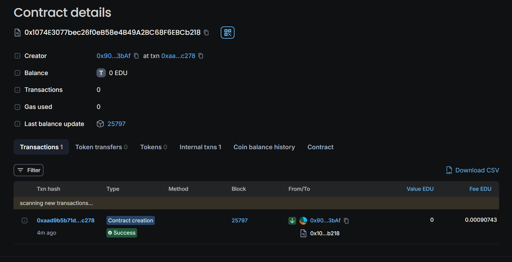

# EduChain Environmental Monitoring

## Vision

The EduChain Environmental Monitoring project aims to harness the power of blockchain technology to monitor, record, and manage environmental data on educational campuses. By utilizing the EduChain platform on the Arbitrum network, we strive to create a decentralized, transparent, and immutable system that tracks environmental metrics such as temperature, humidity, air quality, and more across various campus locations.

Our vision is to empower educational institutions with real-time, verifiable data that can be used to enhance sustainability efforts, optimize resource usage, and provide valuable insights into environmental conditions. This project is designed to promote environmental awareness, encourage data-driven decision-making, and contribute to the global push for greener, more sustainable campuses.

## Deployment Id
0x1074E3077bec26f0eB58e4B49A2BC68F6EBCb218

## Future Scope

### 1. **Integration with IoT Devices**
   - Connect IoT sensors to automatically log environmental data on the blockchain.
   - Expand the types of sensors supported, such as for CO2 levels, noise pollution, and water quality.
   
### 2. **Data Analytics and Visualization**
   - Develop tools for visualizing environmental data trends over time.
   - Implement machine learning algorithms to predict future environmental conditions.
   
### 3. **Decentralized Data Marketplace**
   - Create a marketplace where institutions and researchers can buy and sell environmental data.
   - Enable tokenized incentives for students and faculty who contribute to data collection and analysis.

### 4. **Campus-wide Sustainability Programs**
   - Use data insights to design and implement campus sustainability initiatives.
   - Reward eco-friendly behaviors with tokens that can be redeemed for goods and services on campus.

### 5. **Smart Campus Integration**
   - Integrate with smart campus infrastructure for automated adjustments based on environmental data (e.g., adjusting HVAC systems based on temperature and air quality).
   - Enable cross-campus collaborations by sharing environmental data securely between institutions.

## Use Cases

### 1. **Real-time Environmental Monitoring**
   - Track real-time environmental conditions across different campus locations, providing instant insights into temperature, humidity,
